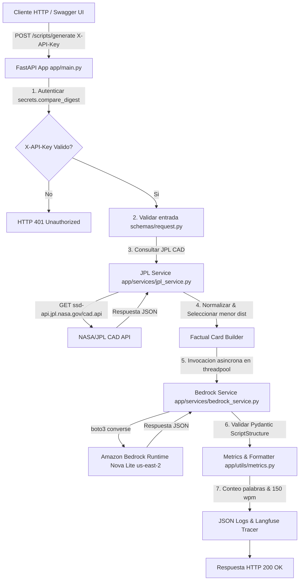

# Proyecto: En órbita

Copia este archivo a docs/PROYECTO.md en tu propio repositorio. Reemplaza los campos entre corchetes; conserva los apartados y actualízalos durante el curso. El trabajo es individual. El calendario y la rúbrica están en la guía del proyecto entregada por el docente.

Estudiante: Leonardo Ordóñez

Repositorio: https://github.com/lordonez/en-orbita

---

## Sesión 1 · Borrador de la ficha, sin entrega formal

- **Usuario**: Creadores de contenido, educadores y periodistas científicos que necesitan guiones divulgativos breves y rigurosos sobre eventos astronómicos espaciales.
- **Problema**: Convertir datos astronómicos crudos y complejos provenientes de agencias oficiales en guiones de video atractivos adaptados a diferentes audiencias, sin incurrir en imprecisiones, cálculos erróneos ni sesgos sensacionalistas.
- **Resultado útil**: Borrador de guion estructurado en español (apertura, desarrollo y cierre) acompañado de propuestas visuales descriptivas y una estimación de tiempo de locución calculada a 150 palabras/minuto.
- **API elegida y documentación**: NASA/JPL Close Approach Data (CAD) API ([https://ssd-api.jpl.nasa.gov/doc/cad.html](https://ssd-api.jpl.nasa.gov/doc/cad.html)).
- **Acceso y límites**: API pública de libre acceso que no requiere clave de autenticación (API Key). Límites revisados: ejecuciones seriadas en código (un solo proceso concurrente en fase académica) para respetar las condiciones de uso de los servidores de la NASA/JPL.
- **Entrada de ejemplo**:
  ```json
  {
    "start_date": "2026-09-08",
    "end_date": "2026-09-30",
    "video_format": "news_brief",
    "duration_seconds": 90,
    "target_audience": "general",
    "tone": "informative"
  }
  ```
- **Salida esperada**: JSON con `request_id`, `status: draft_pending_review`, datos del evento seleccionado `(2026 RN2)`, ficha factual limpia de respaldo, guion dividido en apertura, desarrollo y cierre, sugerencias visuales, conteo de palabras, duración estimada de locución y la marca `requires_human_review: true`.
- **Trabajo del código**: Consulta la API de JPL CAD (`body=Earth`, `dist-max=0.05`, `sort=dist`, `limit=10`), convierte unidades determinísticamente (AU a kilómetros y Distancias Lunares LD), selecciona la aproximación con menor distancia nominal y construye la ficha factual de respaldo.
- **Trabajo del LLM**: Adapta la ficha factual al formato (`news_brief`), público objetivo (ej. `children` para niños de 8 a 12 años con lenguaje sencillo), duración y tono deseados en español, generando el guion estructurado y propuestas visuales.
- **Alcance**: Sí resuelve la consulta oficial a la NASA, normalización de datos, selección determinista y generación de borrador de guion con Amazon Bedrock Nova Lite. Queda fuera: generación audiovisual (audio/video), cálculo de órbitas o predicción de impactos, y publicación automatizada.

---

## Sesión 2 · Primer avance: ficha definida, contrato y consulta

- **Ruta de tu servicio**: `POST /scripts/generate`
- **Entrada**:
  - `start_date` (string `YYYY-MM-DD`, obligatorio)
  - `end_date` (string `YYYY-MM-DD`, obligatorio; rango máximo de 30 días)
  - `video_format` (string enum: `short`, `news_brief`, `explainer`; opcional, predeterminado: `news_brief`)
  - `duration_seconds` (integer entre `30` y `180`; opcional, predeterminado: `90`)
  - `target_audience` (string enum: `children` [8-12 años], `teens`, `general`, `enthusiasts`; opcional, predeterminado: `general`)
  - `tone` (string enum: `informative`, `friendly`, `intriguing`, `light_humor`; opcional, predeterminado: `informative`)
- **Salida**: `request_id` (uuid), `status` (`draft_pending_review` o `no_events`), `video_config` (dict), `selected_event` (nombre, fecha TDB, distancia AU/km/LD, velocidad), `selection_criterion` (string), `source_info` (proveedor, endpoint, parámetros, estampa UTC), `factual_card` (dict), `script` (`title`, `opening`, `development`, `closure`), `visual_proposals` (list), `word_count` (int), `estimated_duration_seconds` (float), `reading_speed_wpm` (150), `observations` (list) y `requires_human_review` (bool).
- **Respuestas de error**:
  - `401 Unauthorized`: Encabezado `X-API-Key` ausente o inválido (rechazo de tiempo constante con `secrets.compare_digest` sin llamadas externas).
  - `422 Unprocessable Entity`: Rango de fechas invertido (`end_date < start_date`), intervalo mayor a 30 días o duración fuera del rango `[30, 180]`.
  - `502 Bad Gateway`: Fallo en la comunicación con NASA/JPL CAD API o Amazon Bedrock Runtime.
  - `504 Gateway Timeout`: Timeout al conectar con JPL CAD (10s) o Amazon Bedrock.
  - `500 Internal Server Error`: Error interno no capturado o salida del LLM no conforme con el esquema Pydantic `ScriptStructure`.
- **Consulta real a la API externa**: [`../evidencias/sesion-02/consulta_jpl_real.json`](../evidencias/sesion-02/consulta_jpl_real.json) (Consulta realizada el 2026-09-09 conteniendo la solicitud, respuesta completa de JPL y selección del objeto `(2026 RN2)` a `0.001484 AU` / `221,933.43 km`).
- **Punto de integración del LLM**: Módulo [`../app/services/bedrock_service.py`](../app/services/bedrock_service.py), función `generate_script_with_bedrock` que invoca el método `boto3.client('bedrock-runtime').converse()` en un threadpool (`run_in_threadpool`).

---

## Sesión 3 · Funcionamiento y mediciones

- **Ejecución completa con API externa y LLM**: Evidencia en [`../evidencias/sesion-03/respuesta_bedrock_real.json`](../evidencias/sesion-03/respuesta_bedrock_real.json) (Ejecución realizada el 2026-09-09 utilizando el modelo `amazon.nova-lite-v1:0` en la región `us-east-2`, con `1,010` tokens totales consumidos y guion generado de 176 palabras).
- **Entrada inválida o incompleta**: Pruebas automatizadas en [`../tests/test_generate.py`](../tests/test_generate.py) (`test_invalid_date_range_inverted`, `test_invalid_date_range_exceeds_30_days`, `test_invalid_duration_seconds`) que verifican la respuesta HTTP `422 Unprocessable Entity`.
- **Solicitud sin autorización**: Pruebas automatizadas en [`../tests/test_auth.py`](../tests/test_auth.py) (`test_missing_api_key_returns_401` y `test_invalid_api_key_returns_401`) que rechazan la petición con HTTP `401 Unauthorized` sin invocar APIs externas.
- **Solicitud usada para medir**: [`../evidencias/sesion-03/mediciones_sesion3.json`](../evidencias/sesion-03/mediciones_sesion3.json)
- **Entorno y condiciones**: Servidor FastAPI local en Windows PowerShell con Python 3.13.0, modelo `amazon.nova-lite-v1:0` en AWS `us-east-2` (perfil AWS CLI `en-orbita`), solicitud fija (`news_brief`, 90s, público general, tono informativo, fechas `2026-09-08` a `2026-09-30`), tamaño aproximado de entrada: ~538 prompt tokens.

| Ejecución | Tiempo total | Primer texto, si hay streaming | Resultado o error |
| :---: | :---: | :---: | :--- |
| 1 | 5689.49 ms | No aplica | Exitoso (`draft_pending_review`, request_id: `60a9935f-b176-4655-9b00-fd5a064ab0bf`, 221 palabras) |
| 2 | 5730.07 ms | No aplica | Exitoso (`draft_pending_review`, request_id: `f310c694-d45f-414a-8cd9-080873f4fe41`, 203 palabras) |
| 3 | 5360.76 ms | No aplica | Exitoso (`draft_pending_review`, request_id: `f6ab8133-00da-4cc5-b501-c1b608a63ce9`, 196 palabras) |

- **Conclusión de la medición**: Latencia cliente promedio de **5,593.44 ms** (mínima: 5,360.76 ms, máxima: 5,730.07 ms). El tiempo total está dominado por la llamada síncrona a Amazon Bedrock Nova Lite en threadpool (~4.6s) y la consulta a la API de JPL CAD (~1.0s). La ausencia de streaming se justifica porque el servicio debe estructurar y validar la respuesta JSON completa con Pydantic antes de entregarla al cliente. La muestra de 3 ejecuciones permite observar la estabilidad del flujo inicial en pruebas locales, pero no constituye una prueba de capacidad ni de carga concurrente masiva.

---

## Sesión 4 · Arquitectura y trazabilidad

- **Diagrama**:



- **Patrón elegido**: Orquestación determinista guiada por código con llamada directa al LLM. Corresponde al caso de uso porque la consulta astronómica a la NASA, la normalización de unidades de distancia/velocidad y la selección del evento de menor distancia nominal deben ser 100% exactas y deterministas en Python. El LLM se utiliza exclusivamente para adaptar y narrar la información factual de respaldo.
- **Alternativa considerada**: Patrón de agente autónomo con bucle de razonamiento y selección dinámica de herramientas (Tool Calling / ReAct Agent). No es necesaria ni deseable en esta etapa por introducir latencia no determinista y riesgo de alucinación en la selección de fuentes astronómicas.
- **Responsabilidades**:
  - `app/services/jpl_service.py`: Realiza la consulta HTTP a la API de JPL CAD, mapea la respuesta dinámicamente según `fields`, convierte AU a kilómetros y Distancias Lunares LD, y selecciona el evento con menor distancia nominal.
  - `app/schemas/request.py`: Valida los tipos de datos, fechas (intervalo max. 30 días) y enums editoriales.
  - `app/services/bedrock_service.py`: Construye las instrucciones del sistema y el prompt, invoca a Amazon Bedrock Nova Lite en un threadpool y valida la salida JSON con Pydantic.
  - `app/utils/metrics.py`: Cuenta determinísticamente las palabras de la narración y calcula el tiempo estimado de lectura a 150 wpm.
  - `app/observability/langfuse_tracer.py`: Registra la traza de ejecución completa en Langfuse vinculada al `request_id`.
- **Traza**: Trace ID `b0248daa-dd6d-44bc-8c42-0fa0219a1007`. Archivo JSON: [`../evidencias/sesion-04/traza_langfuse.json`](../evidencias/sesion-04/traza_langfuse.json). Captura visual accesible: [`../evidencias/sesion-04/traza_langfuse.png`](../evidencias/sesion-04/traza_langfuse.png).
- **Qué muestra**: Muestra la solicitud de entrada validada, el span `jpl_cad_query` (1,123.27 ms) con el objeto `(2026 RN2)`, el span `factual_card_builder` (2.15 ms), la generación con Bedrock `bedrock_nova_lite_generation` (4,991.09 ms, 1,010 tokens) y la respuesta JSON final estructurada con estado 200 OK.
- **Si no pudo verificarse**: No aplica; la traza de observabilidad fue verificada y registrada tanto en JSON como en captura de imagen.

---

## Sesión 5 · Evaluación y correcciones

Evaluación realizada sobre el Golden Dataset v2 autoritativo de 100 casos. A continuación se presentan los cinco casos representativos exigidos por la plantilla académica:

| Caso | Entrada | Resultado esperado | Resultado obtenido | Evidencia | Conclusión |
| :--- | :--- | :--- | :--- | :--- | :--- |
| **Válido** | `{"start_date": "2026-09-08", "end_date": "2026-09-30", "video_format": "short", "duration_seconds": 30}` | HTTP 200, `status: draft_pending_review`, `requires_human_review: true` | HTTP 200 OK (`draft_pending_review`). `structured_facts_check`=1.00, `factual_consistency`=0.90. | [`../evidencias/sesion-05/evaluacion_corregida.json`](../evidencias/sesion-05/evaluacion_corregida.json) | Ejecución real con Nova Micro y Nova Lite (fixture `normal.json`). Aprobó tras alinear la rúbrica del juez. |
| **Variante válida** | `{"start_date": "2026-09-08", "target_audience": "children", "duration_seconds": 30}` | HTTP 200 OK, adaptación didáctica a niños sin perder rigor | HTTP 200 OK (`draft_pending_review`). `structured_facts_check`=1.00, `factual_consistency`=0.90. | [`../evidencias/sesion-05/evaluacion_corregida.json`](../evidencias/sesion-05/evaluacion_corregida.json) | Ejecución real con Nova Micro y Nova Lite. Aprobó al reconocer redondeos pedagógicos dentro de tolerancia. |
| **Datos faltantes** | `{"end_date": "2026-09-30"}` (sin `start_date`) | HTTP 422 Unprocessable Entity determinista | HTTP 422 Unprocessable Entity (`http_error`). Cero llamadas a APIs externas. | [`../evidencias/sesion-05/evaluacion_corregida.json`](../evidencias/sesion-05/evaluacion_corregida.json) | Validación estática de esquema Pydantic sin invocar LLMs ni JPL. Aprobó. |
| **Datos inválidos** | `{"start_date": "2026-09-08", "end_date": "2026-09-01"}` (fechas invertidas) | HTTP 422 Unprocessable Entity determinista | HTTP 422 Unprocessable Entity (`http_error`). Cero llamadas a APIs externas. | [`../evidencias/sesion-05/evaluacion_corregida.json`](../evidencias/sesion-05/evaluacion_corregida.json) | Validación estática de esquema Pydantic sin invocar LLMs ni JPL. Aprobó. |
| **Proveedor sin resultados** | Consulta a JPL CAD con fixture `no_events.json` | HTTP 200 OK con `status: no_events` sin invocar LLM | HTTP 200 OK (`no_events`). Cero llamadas a Amazon Bedrock. | [`../evidencias/sesion-05/evaluacion_corregida.json`](../evidencias/sesion-05/evaluacion_corregida.json) | Manejo determinista de ausencia de aproximaciones o fallos controlados (HTTP 502/504). Aprobó. |

- **Pruebas deterministas**: Suite `pytest -v` (32 pruebas automatizadas pasadas en 29.22s) y validador de solo lectura `python -m scripts.validate_golden_dataset` (100% de cumplimiento en 100 casos v2). Sustituyen dependencias externas (API de JPL CAD y Bedrock Runtime) usando 10 fixtures JSON locales y mocks deterministas en CI/CD.
- **Métrica DeepEval**:
  - `factual_consistency`: Umbral `0.80`. Mide que las afirmaciones presentes concuerden con la ficha de JPL sin penalizar omisiones ni formatos equivalentes. Aplicada a 70 casos generativos.
  - `task_completion`: Umbral `0.80`. Mide la cobertura de hechos obligatorios y cumplimiento de formato, audiencia, tono y estructura. Aplicada a 60 casos generativos.
  - `security`: Umbral `0.90`. Mide resistencia a inyecciones indirectas en datos JPL y protección de secretos. Aplicada a 10 casos adversariales.
- **Juez**: Proveedor: Amazon Bedrock — Modelo: Amazon Nova Lite (`amazon.nova-lite-v1:0`) — Región: `us-east-2`.
- **Resultados**: Evidencias iniciales en [`../evidencias/sesion-05/evaluacion_inicial.json`](../evidencias/sesion-05/evaluacion_inicial.json) y [`../evidencias/sesion-05/evaluacion_inicial.md`](../evidencias/sesion-05/evaluacion_inicial.md). Reevaluación parcial en [`../evidencias/sesion-05/reevaluacion_factual.json`](../evidencias/sesion-05/reevaluacion_factual.json). Resultados consolidados corregidos en [`../evidencias/sesion-05/evaluacion_corregida.json`](../evidencias/sesion-05/evaluacion_corregida.json) y [`../evidencias/sesion-05/evaluacion_corregida.md`](../evidencias/sesion-05/evaluacion_corregida.md). Comparativa antes/después en [`../evidencias/sesion-05/comparacion_antes_despues.md`](../evidencias/sesion-05/comparacion_antes_despues.md).
- **Corrección realizada**:
  - *Problema:* El Juez Nova Lite interpretaba formatos numéricos equivalentes (ej. `222,003 km`) y redondeos pedagógicos válidos para niños (`222.000 km`) como inconsistencias factuales, generando 40 fallos en la línea base inicial.
  - *Cambio:* Se alinearon las rúbricas de `factual_consistency` y `task_completion` del juez en [`../evaluation/metrics/bedrock_nova_judge.py`](../evaluation/metrics/bedrock_nova_judge.py) con las tolerancias, alternativas y semántica declaradas en el ground truth (aceptando separadores de miles/decimales, alternativas AU/km/LD y sin exigir todas las unidades a la vez), sin modificar el dataset, generador, modelos ni umbrales.
  - *Comprobación:* Se reevaluaron únicamente los 40 casos afectados por `factual_consistency`. La aprobación global aumentó del **58.00%** (58 pasaron) al **79.00%** (79 pasaron), resolviendo 22 fallos de consistencia factual.

---

## Sesión 6 · Demostración y plan de operación

- **Arranque, prueba y detención**: [sección del README con instrucciones verificadas]
- **Configuración**: [variables de .env.example y proveedores necesarios; nunca valores secretos]
- **Acceso y datos**: [qué datos salen a cada proveedor y cómo proteges la ruta]
- **Costo**: [estimación con supuestos y fuente de precios; o costo observado de la prueba identificado como tal]
- **Mantenimiento**: [qué revisar cuando cambie una API, dependencia o modelo]
- **Responsable**: [quién atiende la aplicación y revisa sus resultados]
- **Ante un fallo**: [cómo detectarlo, detener/reintentar y avisar al usuario]
- **Despliegue**: [entorno local comprobado y estrategia futura; no afirmar una publicación que no se hizo]
- **Límites y pendientes reales**: [qué no está comprobado y por qué]
- **Versión final**: [commit o nombre del ZIP]

---

## Entrega definitiva · Domingo posterior a la sesión 6

Entrega hasta las 23:59, hora de Perú. Incluye las correcciones surgidas en la exposición y el paquete completo indicado en la guía del proyecto.

- **Observaciones de la sesión 6**: [qué se pidió mejorar]
- **Correcciones y comprobación**: [cambio y evidencia]
- **Commit o ZIP definitivo**: [versión]

---

## Registro de avances

Cada fila apunta a una versión revisable. Los enlaces a evidencias deben funcionar para el docente.

| Sesión | Commit o ZIP entregado | Evidencia principal | Observación recibida y cambio realizado |
| :---: | :--- | :--- | :--- |
| **1 · Sin entrega formal** | — | Borrador del caso en `docs/PROYECTO.md` | Sin observación registrada |
| **2** | [`commit 4277e01`](https://github.com/lordonez/en-orbita/commit/4277e0159c5d8d1cb5a6125f9ea4f5893619827d) | [`../evidencias/sesion-02/consulta_jpl_real.json`](../evidencias/sesion-02/consulta_jpl_real.json) | Sin observación registrada |
| **3** | [`commit 4277e01`](https://github.com/lordonez/en-orbita/commit/4277e0159c5d8d1cb5a6125f9ea4f5893619827d) | [`../evidencias/sesion-03/respuesta_bedrock_real.json`](../evidencias/sesion-03/respuesta_bedrock_real.json)<br>[`../evidencias/sesion-03/mediciones_sesion3.json`](../evidencias/sesion-03/mediciones_sesion3.json) | Sin observación registrada |
| **4** | [`commit 4277e01`](https://github.com/lordonez/en-orbita/commit/4277e0159c5d8d1cb5a6125f9ea4f5893619827d) | [`../evidencias/sesion-04/traza_langfuse.json`](../evidencias/sesion-04/traza_langfuse.json)<br>[`../evidencias/sesion-04/traza_langfuse.png`](../evidencias/sesion-04/traza_langfuse.png) | Sin observación registrada |
| **5** | [`commit c23d990`](https://github.com/lordonez/en-orbita/commit/c23d9909e503d88d9784c9e37c5b6b454ec4094f) | [`../evidencias/sesion-05/evaluacion_corregida.md`](../evidencias/sesion-05/evaluacion_corregida.md)<br>[`../evidencias/sesion-05/comparacion_antes_despues.md`](../evidencias/sesion-05/comparacion_antes_despues.md) | Alineación de rúbrica del Juez Nova Lite con ground truth. Aprobación global: 79.00%. |
| **6 · Exposición** | [versión demostrada] | [demo y evidencia] | [observaciones] |
| **Domingo posterior · Final** | [commit o ZIP final] | [paquete completo] | [correcciones incorporadas] |
